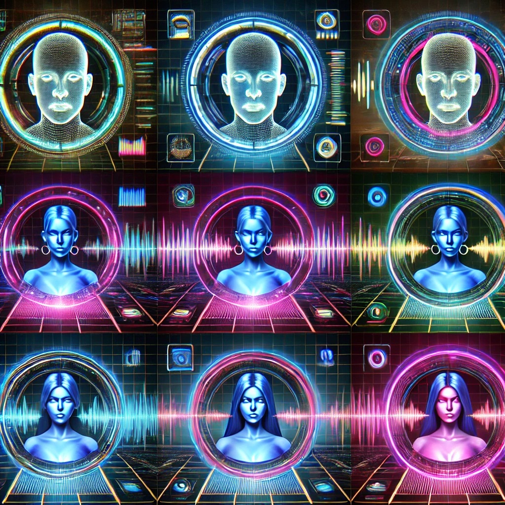

## Real-Time Gender detection app

This is a real-time gender detection app that uses a pre-trained wav2vec2 model to classify the gender of a speaker from their voice. The app is built using Streamlit and leverages the power of transformers from the Hugging Face library.

### Demo Video

Watch the demo video below to see the app in action:

### Features
- Real-time audio processing
- Gender classification using a pre-trained wav2vec2 model
- Simple and intuitive user interface

### How to Use
1. Clone the repository to your local machine.
2. Ensure you have Python 3.10 installed on your system.
3. Install the required dependencies using `pip install -r requirements.txt`.
4. Run the app using `streamlit run app.py`.
5. Click the 'Start' button to begin real-time gender detection from your microphone input.

### Dependencies
- streamlit
- numpy
- torch
- transformers
- pyaudio

### Model
The app uses the `alefiury/wav2vec2-large-xlsr-53-gender-recognition-librispeech` model from Hugging Face for gender recognition.

### Approach
The app uses the `alefiury/wav2vec2-large-xlsr-53-gender-recognition-librispeech` model from Hugging Face for gender recognition. The model is a pre-trained wav2vec2 model for gender recognition on the LibriSpeech dataset. The model is loaded using the `AutoFeatureExtractor` and `AutoModelForAudioClassification` classes from the Hugging Face library.

The app uses the `pyaudio` library to capture the audio from the microphone. The audio is captured using the `pyaudio` library and the `AudioStream` class. The audio is captured using the `AudioStream` class and the `start_stream` method. The audio is captured using the `AudioStream` class and the `stop_stream` method.

The app uses the `streamlit` library to create the web application. The app is configured to use a 16kHz sampling rate and mono audio input. 

### Configuration
The app is configured to use a 16kHz sampling rate and mono audio input. The audio stream parameters are defined as follows:
- FORMAT: 16-bit resolution
- CHANNELS: 1 (Mono audio)
- RATE: 16000 (16kHz sampling rate)
- CHUNK: 1024 (Number of frames per buffer)

### Logging
The app uses Python's built-in logging module to log information with a basic configuration that includes timestamps and log levels.

### License
This project is licensed under the Apache-2.0 License.

### Acknowledgements
- Hugging Face for providing the pre-trained wav2vec2 model.
- Streamlit for the easy-to-use web application framework.
- PyAudio for handling audio input.

### Huggingface Space deployment
https://huggingface.co/spaces/prashant-garg/gender-detection

**Note:** The model is hosted on Huggingface and the app is deployed on Huggingface Spaces. But there is an issue with the audio input. The app is not able to capture the audio from the microphone as huggingface spaces does not have audio drivers enabled.

